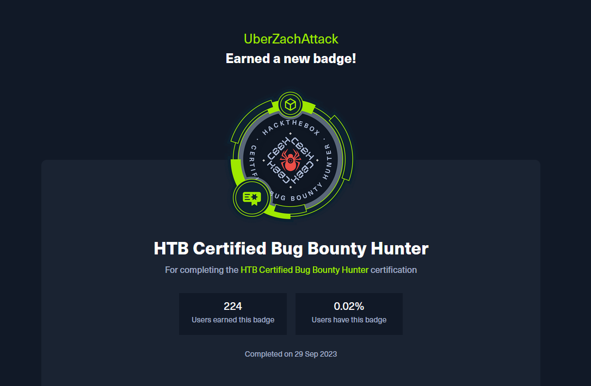

After becoming 1 of 224 with [Certified Bug Bounty Hunter](https://academy.hackthebox.com/preview/certifications/htb-certified-bug-bounty-hunter), I wanted to write down my experience and hopefully inspire and or at least give insight to people interested in CBBH.

### Why 

I was looking into various web application penetration testing certifications, and all the ones that I saw did not fit my needs. I was looking for an up-to-date certification that did not expire and that I could trust giving me a challenge. The ones that were on the market were either outdated, required subscriptions, the certification had to be renewed, or the course and certification were unnecessarily expensive.

That is when I stumbled upon HackTheBox's Certified Bug Bounty Hunter. Initially, I did not like it. I did not like the subscription model that HackTheBox used for academy, as well as the cube system that is implemented. I did not want to have to pay for a subscription on top of the one I already pay for VIP on the main platform.

However, [bmdyy's video review](https://www.youtube.com/@bmdyy) made me reevaluate CBBH. 



One thing that stuck out to me is when he mentioned that [you could use information found within the exam on another web application](https://youtu.be/6ISUuMBzCyo?t=540). This piqued my interest since I did not hear about or see anything regarding this in any other web application based certification.

Another thing that me made want to pursue the CBBH was the pricing. After looking into the cube system and calculating out how much it would cost to purchase the certification and training required up-front, the price point was good to my surprise. Add in that fact that the course training from CBBH aids in completing the Penetration Tester path required for [Certified Penetration Testing Specialist](https://academy.hackthebox.com/preview/certifications/htb-certified-penetration-testing-specialist), I bought everything required for CBBH.

Below is the full price breakdown. 

**NOTE: This is based on the current prices of cubes as of 10/8/23**

For those that just want to take the CBBH:
```
CBBH: Voucher ($210) + Modules ($141 in cubes) = $351 

$360 in total rounding up with cube prices ($100 + $50 in cubes)
```
(If you want to, you can just spend `$145` by buying cubes with the amounts of `$100 + $20 + $20 + $5`)

For those that just want to take the CPTS:
```
CPTS: $210 + $197 = $407

$410 in total rounding up with cube prices ($100 + $100 in cubes)
```

The standalone prices for the certifications are comparable to other certifications on the market. However, the pricing really shines if you plan on taking both the CBBH and CPTS.

There are a few caveats however.  Assuming that you finish the first two modules, Introduction to Academy and Learning process, this will add 20 extra cubes with the 50 cubes that each HTB academy account starts with:
```
Both Vouchers: 210 + 210 = $420

Training for CBBH: $150 (In cubes) 

Training for CPTS with CBBH cubes: 114 - 49 = $65

Total: 420 + 150 + 65 = $635
```

To explain some of the numbers, the value `49` comes from the 70 cubes that you will have before you purchase the modules for CBBH and the 90 cubes leftover from purchasing the path. Then, once you complete the CBBH path, you will get back 330 cubes. So once everything is done with CBBH, you should have `490` cubes. But the price for both certifications with the quaility instruction provided within the trainings is a great deal. 

As for the amount of progress you gain within CPTS after completing the CBBH path, you get ~30% (`28.96%`) completion for CPTS. Module wise, you complete 11/28 modules required for the path.

One worry that might be on your mind is access to Pwnbox, the Parrot OS VM that HTB Academy provides you to complete the questions and skill assessments that require tools to complete. Based on some of the wording found on the billing page, it might lead you to believe that the Pwnbox has limited usage if you don't have a subscription. However, the [FAQ](https://academy.hackthebox.com/faq) states *"Get unlimited Pwnbox access by either subscribing for any plan or buying any amount of cubes in Academy's billing page"*. Once, I bought everything in full, I did not have a restriction on Pwnbox usage.

I did not have any issues with Pwnbox the during the entire time that I was completing the CBBH path. The only minor inconveniences were when I spent too long on a skills assessment and the time ran out on the Pwnbox. The only time that I used my own personal VM when I was completing a question and it was within HTB's internal network due to the attacks that needed to be performed. Specifically, it was the phishing and session sections within the Cross-Site Scripting (XSS) module. Every other time that I needed to complete interactive sections and skill assessments, I used Pwnbox.

However, for those that just want to use their own machine, the VPN access works well. Most of the time the interactive sections are publicly accessible, so no VPN is required. There are very few interactive sections that require a VPN, such as the two sections from the XSS module mentioned earlier.

### Course Material

I must say, the CBBH path is a true zero to hero course. It starts off with the basics of web applications, HTTP requests, and how to use web proxies. Then it slowly ramps up into XSS, SQLi, command injection, and then SSRF to name a few. The material within the modules is nothing short of extremely through and dense. The HTB Academy team did an excellent job of providing all the knowledge you needed to have a strong base within topic covered. Even the small tips and notes provided within the modules helped give more perspective on what was being taught.

There were a few modules that I thought did an excellent job of testing your skills that you learned within the sections on the final skill assessments. Most of these were quite hard, but excellent for the simple fact that it helped reinforce and develop your methodology and made you use almost every technique / method that was taught. 

Those were:
- Broken Authentication
- Wordpress
- Session Security
- SQL Injection Fundamentals

This isn't to say that the other modules within the CBBH path are not as strong as the ones I listed above. The HackTheBox Academy team did an excellent job of providing interactive sections that test the knowledge that you just learned. There were times when the interactive sections were harder than the final skill assessment in some modules. The modules that come to mind are Command Injections and File Uploads.

### Exam

The exam is 7 days, you are given a Letter of Engagement with the in-scope and out-of-scope items, the web applications to assess, and a overview of the exam objectives which are the amount of points needed to pass and to submit a report with your findings using the provided report template. 

My first attempt did not go as well as I thought. However, I was able to refine parts of my methodology and realize what problems I had with my approach. For certain parts of the exam I had tunnel vision and glossed over things that could have gotten me points but I only focused on doing certain things within the exam. At later stages, I only focused on certain attacks and left other parts of the exam alone knowing that the review would help aid me in what to look for in my second attempt.

I submitted my report and received my review after 9 days. The review and tips provided were very generous and helped guide me into what I needed to focus on during the next attempt. Since I had 14 days until I needed to take the second retake, I revisited the modules that were listed within the review.

My second attempt was more successful. I still found myself having tunnel vision and making assumptions on what the attack vectors would be. After some persistence, I was able to get enough points to pass. I submitted my report early in the morning and got my results back within the same day.

One of the things that I wanted to make sure I did a good job at was the report. I used the first attempt to gauge what the HTB Academy team was looking for within the report. With my second attempt review, I was surprised that they thought my report was well done. There were no critiques given even when I thought I would get some.

*"We found your report to be very well done. You captured the description and impact of each vulnerability very well. You gave actionable remediation recommendations that do not break the line of independence that we must maintain as bug bounty hunters/pentesters (essential third-party auditors) by recommending specific technologies or attempting to re-write the customer's code in the report."*

Although technical ability is very important within offensive security, report writing is a important corner stone that is often overlooked. With this, I was able to gain new technical abilities within web application penetration testing as well as an idea of what a good report should be. 

### Conclusion

Overall, I believe this would an excellent choice for anyone that wants to learn more and test their skills within web application penetration testing.

The coursework took about ~94 hours in total for me. There were some modules that I completed faster than the estimated time and others where I stayed up until 3 A.M. trying to get a command to work. I was able to complete half of the course over a course of two weeks by putting 4 hours in everyday. During that time, I was aiming to complete one module everyday. As stated previously however, there were some modules that took me 2 days due to how dense the material was and how difficult the interactive sections / skill assessments were.

Adding up all the hours for the modules, you get about ~150 hours total. This goes close with what course creators and HTB staff have said with how they calculated the estimated time. The Bug Bounty Path is estimated to be 18 days if you spend around 8 hours each day completing the course work. It might take longer depending on your level of experience and knowledge.

The exam itself is good but overwhelming as well. The biggest thing is that the exam requires you to do is to combine things learned within the modules together that weren't spoken about in tandem. You really have to leave no stone unturned when taking it. Add on top of that the black box approach you have to take with the exam.

As for preparing the exam, reviewing and going over the interactive sections and the skill assessments from the modules will be enough. However, if you feel like you need more practice outside of the modules [PortSwigger Academy](https://portswigger.net/web-security) is the best place to help reinforce what you learned.

Some tips that helped me when pursuing this:
- Track your progress, HTB already does part of it for you but to look back and see when you completed modules definitely helps in seeing the journey from a bigger picture and giving yourself some extra motovation.
- For each question and skill assessment that you do, **COPY DOWN WHAT STEPS YOU TOOK.** This includes how you approached the questions / assessments / website, how you found the initial part of answering the question, the steps you took to complete the question, and most importantly **what commands you ran**. 
- Take your time, this isn't a sprint. There is a lot of information to process then to study for the exam. Make sure you reflect back on what modules and questions were the hardest for you to complete and review what stumped you the most. This is where the last tip comes in handy.
- Note down anytime certain attacks mention other attacks within it. For example, SSRF leveraging XSS or API attacks using SQLi. 
- Create a cheat sheet for yourself for the exam. Take all of your notes and what was taught within the modules and shrink it to a couple of sentences of what to look for and a command to run whenever you are in that situation as described within that section. It will make your life a lot easier. Or better yet, reference the cheat sheets provided within the modules.

If you find yourself interested in tackling the CBBH yourself, you still haven't registered for an account on HackTheBox Academy, and thought my article did a good job of covering important aspects of what the CBBH is like, here is a shameless plug for [my referral link](https://referral.hackthebox.com/mzwwFTB). If you find yourself not aligning with any of the statements said previously, then ignore the link.
