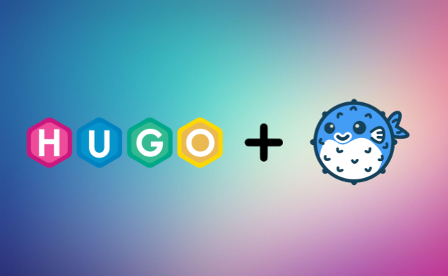

I will be going over why I decided to create my own website and how you can do the same using [Hugo](https://gohugo.io/) and the [Blowfish theme](https://blowfish.page/).

## Why

I got my inspiration to create this site from Luke Smith, specifically from this [video](https://youtu.be/ZFL09qhKi5I) he made about Hugo. Realizing how easy it was to make a website and his thoughts on internet independence (becoming a internet landlord) really resonated with me.

Don't get me wrong, sites like [Medium](https://medium.com/) and [Hashnode](https://hashnode.com/) are great for posting articles. However, I wanted to have the freedom with having a personal site hosted somewhere. Medium and Hashnode are only meant for posting articles, while with a personal site you can post articles and do whatever else you would like. 

Plus, creating your articles in markdown and not having to worry about HTML and CSS is great. This made my decision easier since I already use [Obsidian](https://obsidian.md/) for my notes. I can simply copy-paste articles that I write within Obsidian over to Hugo.

Here is a quick list of all the reasons why I choose to create my own site.
- To have internet independence as stated previously. In other words, relying less on platforms or services like social media and creating you own. 
- A place to share my projects, thoughts, and ideas and to help other people at the same time. To pay it forward.
- Convenience of using markdown for articles. 
- Having one place that I could put stuff within instead of having separate things on multiple sites.
- Resume booster and personal branding.
- Running a website costs less than $15 on average.
- Most importantly, **creative output**. I feel like this is something that is not talked about as much as it needs to be. Having an outlet to where you can be creative is important since it is direct expression of who you are. Writing might not be viewed as the most creative medium but it still counts.
- Finally, a quote that I enjoy. "*Find three hobbies you love: One to make you money, one to keep you in shape, and one to be creative.*" Why not have 2 of the hobbies be connected in some way? 

## Setup and Prerequisites
Here are some of the things needed to create your first site. 
- Domain name
- Hosting service 
- Linux virtual machine to develop the site 
- GitHub account

#### Domain Name and Hosting
A good friend of mine recommended that I check out [Cloudflare Pages](https://pages.cloudflare.com/). They offer free static site hosting, domain name registration, and built utilities like website traffic analytics. 

Search for the domain name that you would like your site to have and pick an extension that you would like. Depending on the popularity of your domain name, the average price will be around $12. There are other domain registrars where you can buy your domain name for less, but it usually hovers around ~$10. 

The quickest way to get a domain name if you have a Gmail account is to head to [Google Domains](https://domains.google.com/registrar/). If you are against giving Google owning more of your data, you can choose [Epik](https://www.epik.com/) or [Domain.com](https://www.domain.com/). There are many registrars out there to choose from.

As for hosting, you can go with [Digital Ocean](https://www.digitalocean.com/), Amazon, Azure, or [Vultr](https://www.vultr.com/).

The important thing with finding a hosting service is to find one that is able to host static sites and have automatic TLS / SSL encryption. Digital Ocean is another good choice since the Starter plan is free and hosts 3 static sites, it's only $3 a month for every additional site. 

If you are feeling adventurous, you can go down the route of using a VPS and creating it with Nginx and certbot, [LandChad.net](https://landchad.net/) is a good place to start for that.

#### Development area
I just use a Ubuntu virtual machine to run Hugo and create articles. 

Just ensure that [Go](https://go.dev/) and [Hugo](https://gohugo.io/) are updated and ready to be used.

#### GitHub Account
The most important component within this equation. This is where the site will be stored and how the hosting service will find the code for your website. 

## Building the Site
Now that everything is prepared, we can start using Hugo and Blowfish.

First, create a new site with Hugo with `hugo new site <site name>`. This will create a new directory where you ran the command.

Then, download the theme using git. 
```bash
cd mywebsite
git init
git submodule add -b main https://github.com/nunocoracao/blowfish.git themes/blowfish
```

Finally, read over the [Blowfish documentation](https://blowfish.page/docs/) so that you have a proper understanding of how to utilize the theme. 

Now, assuming that you didn't read the documentation, here are the important things of note. 
- Understanding the page structure with Hugo, such as Branch vs Leaf pages
- Understanding the directory structure of Hugo
	- `content/` is where the articles will be stored in markdown, `public/` is where the HTML will be generated once you are done creating your site
- The notable articles are [Configuration](https://blowfish.page/docs/configuration/), [Shortcodes](https://blowfish.page/docs/shortcodes/), [Series](https://blowfish.page/docs/series/), [Content Examples](https://blowfish.page/docs/content-examples/)
- Create the homepage by running `hugo new _index.md`
- Setup the configuration files as described within the documentation
	- Setup `config.toml`, then configure preferences you would like within `languages.en.toml`, `menus.en.toml`, and `params.toml`
		- `languages.en.toml` dictates how your homepage will look and controls some overarching settings that affect the entire site
		- `menus.en.toml` controls the menu at the header and footer of the page
		- `params.toml` is where most of the magic happens. This has most of the settings for the website and has settings for how your articles / posts will look like
- Whenever creating an article / post, you can directly overwrite a setting from the `params` file if you would like to change the way the article behaves
- Have two terminal windows open, one running `hugo server -D -noHTTPCache` and the other being used to create and modify markdown pages
	- The `hugo server` command will build draft pages (`-D`) and prevent HTTP caching (`-noHTTPCache`)
	- `hugo server` will create your site locally at `localhost:1331`, this will allow you to see any changes you make live

The rest should be fairly simple. Create markdown files with the `hugo new` command and experiment with the site. Ensure that pages aren't in "draft" mode when you are creating some parts of your website and or ready to build the site.

## Making the Site Live

Now that you created a good base for your website, it's time to upload it to GitHub and link it to your hosting service. 

Simply run `hugo` within your site directory to convert the markdown files into HTML. This will be stored within the `public/` directory. 

Once the files are ready, create and setup a new repository on GitHub for your site. Then commit and push the files to the repository. 

I used [GitKraken](https://www.gitkraken.com/) to make things easy. I created a new project directory with the `public` folder and created a new remote repository using the link generated from the newly created GitHub repository (The link should look like `https://github.com/<Your Name>/<site repository>.git`). Then you should see the files on the left side that can be committed. Once that is done, simply use the push button at the top. Confirm that all the files are in your site repository. 

Then, go over to the hosting service of your choice to grab the repository files. With Cloudflare Pages, I simply created a new website in the dashboard with my domain name. I then went to the `Workers and Pages` menu on the left and made a new page. 

Cloudflare will walk you through connecting your account and linking your repository. The next few steps are very simple once you link your repository. 

Once the site is deployed in Cloudflares network, click on your Cloudflare Page to go into the settings and head over to `Custom domains`. Simply press `Set up a custom domain` and type in the domain name that you bought for your site. 

## Updating the Site

Now that the hard part is over, all that needs to be done to have a reliable way of updating your site repository. 

As stated previously, using GitKraken makes it very easy. Once there are more articles made that are ready to be put onto the site, simply run `hugo` and commit and push the changes within GitKraken. 

As for Cloudflare, it will take a while for it to update the page. The site can be redeployed manually within the Page overview section to have it update faster. 


---

I hope this article helped you with knowing that making your own site isn't that hard and doesn't cost that much. Now go out and create your own site and have fun while doing it. 
